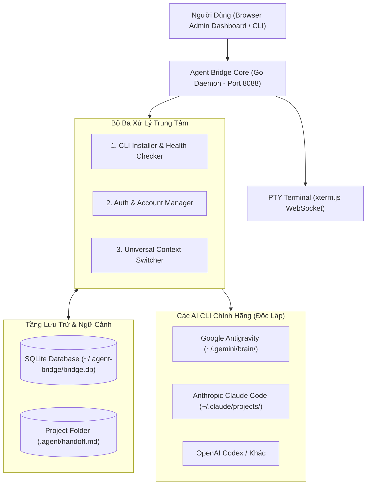

# Kế Hoạch Triển Khai: Chuyển Đổi Sang Agent Bridge (Agent Switcher & Context Bridge)

> **Mục tiêu**: Thay thế Web GUI Chat phức tạp bằng **Agent Bridge** — một Admin Dashboard tối giản chạy nền (Go + React Vite + PTY Terminal), chuyên trách 3 nhiệm vụ sống còn:
> 1. Tự động kiểm tra / Cài đặt 1-click các AI CLI (`antigravity`/`agy`, `claude`, `codex`).
> 2. Quản lý trạng thái Đăng nhập / Multi-account / Login Interactive Terminal.
> 3. Làm cầu nối ngữ cảnh (Context Bridge) theo Workspace Folder & Universal Session ID, cho phép chuyển đổi qua lại giữa các Agent AI mà vẫn resume chính xác công việc dang dở.

---

## 1. Kiến Trúc Tổng Thể & Cơ Chế Hoạt Động



---

## 2. Thiết Kế Cơ Sở Dữ Liệu (SQLite Schema)

Database đặt tại: `~/.agent-bridge/agent_bridge.db`.

```sql
-- 1. Quản lý các Workspace Folder
CREATE TABLE IF NOT EXISTS workspaces (
    id TEXT PRIMARY KEY,
    path TEXT UNIQUE NOT NULL,
    name TEXT NOT NULL,
    active_bridge_session_id TEXT,
    created_at DATETIME DEFAULT CURRENT_TIMESTAMP,
    updated_at DATETIME DEFAULT CURRENT_TIMESTAMP
);

-- 2. Quản lý các Universal Sessions (Mỗi session là 1 task/công việc)
CREATE TABLE IF NOT EXISTS bridge_sessions (
    id TEXT PRIMARY KEY,
    workspace_id TEXT NOT NULL,
    title TEXT NOT NULL,
    status TEXT DEFAULT 'active',      -- 'active' | 'paused' | 'completed'
    current_agent TEXT NOT NULL,       -- 'agy' | 'claude' | 'codex'
    last_handoff_summary TEXT,
    created_at DATETIME DEFAULT CURRENT_TIMESTAMP,
    updated_at DATETIME DEFAULT CURRENT_TIMESTAMP,
    FOREIGN KEY (workspace_id) REFERENCES workspaces(id) ON DELETE CASCADE
);

-- 3. Bảng Ánh Xạ Session ID Gốc của Từng Agent vào Bridge Session (Khắc phục việc mỗi hãng có 1 Session ID riêng)
CREATE TABLE IF NOT EXISTS agent_bindings (
    id INTEGER PRIMARY KEY AUTOINCREMENT,
    bridge_session_id TEXT NOT NULL,
    agent_name TEXT NOT NULL,          -- 'agy' | 'claude' | 'codex'
    native_session_id TEXT NOT NULL,   -- UUID hoặc hash của CLI đó
    session_file_path TEXT,            -- Đường dẫn transcript/log gốc
    is_current INTEGER DEFAULT 0,
    created_at DATETIME DEFAULT CURRENT_TIMESTAMP,
    updated_at DATETIME DEFAULT CURRENT_TIMESTAMP,
    UNIQUE(bridge_session_id, agent_name),
    FOREIGN KEY (bridge_session_id) REFERENCES bridge_sessions(id) ON DELETE CASCADE
);

-- 4. Nhật Ký Bàn Giao Ca (Handoff Checkpoints)
CREATE TABLE IF NOT EXISTS handoff_checkpoints (
    id INTEGER PRIMARY KEY AUTOINCREMENT,
    bridge_session_id TEXT NOT NULL,
    from_agent TEXT NOT NULL,
    to_agent TEXT NOT NULL,
    from_native_id TEXT,
    to_native_id TEXT,
    trigger_reason TEXT,               -- 'manual_switch' | 'quota_429' | 'cli_command'
    task_goal TEXT,
    git_diff_summary TEXT,
    context_snapshot TEXT,             -- Nội dung markdown inject vào agent mới
    created_at DATETIME DEFAULT CURRENT_TIMESTAMP,
    FOREIGN KEY (bridge_session_id) REFERENCES bridge_sessions(id) ON DELETE CASCADE
);

-- 5. Trạng Thái Cài Đặt & Tài Khoản Của Các CLI
CREATE TABLE IF NOT EXISTS cli_engines (
    id TEXT PRIMARY KEY,               -- 'agy', 'claude', 'codex'
    display_name TEXT NOT NULL,
    binary_path TEXT,
    is_installed INTEGER DEFAULT 0,
    install_command TEXT,
    auth_status TEXT,                  -- 'logged_in', 'expired', 'not_authenticated'
    active_account TEXT,
    last_health_check DATETIME
);
```

---

## 3. Quy Trình Chuyển Đổi & Bàn Giao Ngữ Cảnh (Context Handoff Flow)

Khi người dùng nhấn nút **"Switch to Claude Code"** (hoặc gõ `agent-bridge switch claude`):

1. **Thu thập dữ liệu bối cảnh hiện tại (Context Capture)**:
   - Đọc `native_session_id` của Agent vừa chạy (ví dụ Antigravity: `~/.gemini/antigravity-cli/brain/<id>/transcript.jsonl`).
   - Lọc lấy 3–5 lượt trao đổi gần nhất (User Prompt, Agent Response, kết quả Tool vừa chạy).
   - Chạy lệnh `git status -s` và `git diff --stat` trong workspace folder để phát hiện các file vừa được chỉnh sửa.
2. **Tạo bản tóm tắt bàn giao (Handoff Snapshot)**:
   - Định dạng Markdown chuẩn:
     ```markdown
     ## AGENT BRIDGE CONTEXT HANDOFF
     - **Project**: /home/chungnh/AI Workspace
     - **Previous Agent**: Google Antigravity (Session: 15cee76f...)
     - **Task Goal**: Sửa lỗi migration và hoàn thiện API
     - **Touched Files**: internal/server/routes.go, web/src/App.tsx
     - **Status / Next Steps**: Đã hoàn thành route Go, đang đợi test build
     ```
   - Ghi vào file local `.agent/handoff.md` trong workspace folder.
3. **Kích hoạt Agent mới (Resume or Launch)**:
   - Tra cứu bảng `agent_bindings`:
     - Nếu Claude đã có `native_session_id` trước đó trong task này $\rightarrow$ Gọi lệnh `claude --resume <native_session_id> -p "..."`.
     - Nếu Claude chưa từng chạy trong task này $\rightarrow$ Khởi động phiên mới của Claude kèm prompt nạp toàn bộ nội dung từ `.agent/handoff.md`.
4. **Cập nhật trạng thái**:
   - Ghi checkpoint vào `handoff_checkpoints`.
   - Cập nhật `current_agent = 'claude'` trong `bridge_sessions`.

---

## 4. Thiết Kế Giao Diện Admin Dashboard Tối Giản (Single Page UI)

Giao diện chỉ gồm 1 màn hình duy nhất, chia làm 3 khối chức năng rõ ràng:

1. **Header Bar**:
   - Logo: **Bridge** `Agent Bridge` (v2.0).
   - **Workspace Selector**: Dropdown chọn thư mục dự án đang làm việc (`/home/chungnh/AI Workspace`).
   - **Active Session**: Dropdown chọn task hoặc bấm `+ New Task Session`.
   - Nút bật/tắt nhanh **Terminal Drawer**.
2. **Cụm 1: AI Engines & Auth Manager (Cards)**:
   - Mỗi Engine là 1 Card:
     - **Google Antigravity**: Icon, Trạng thái (Installed / Missing), Tài khoản đăng nhập (OAuth Active / ADC), Quota (Session / Weekly Remaining %), Nút `Switch Account`.
     - **Claude Code**: Icon, Trạng thái (Installed / Missing - Kèm nút 1-Click `Auto Install`), Trạng thái Login (`claude auth status`), Nút `Login via Terminal` / `Switch Account`.
     - **OpenAI Codex**: Trạng thái (Installed / Missing), Cấu hình API Key / OAuth.
   - Nút hành động nổi bật trên mỗi Card: **`[⚡ Switch to this Agent]`**.
3. **Cụm 2: Active Context & Handoff Summary**:
   - Hiển thị tóm tắt task hiện tại đang bàn giao.
   - Danh sách file thay đổi gần nhất (`Git Diff Changes`).
   - Nút `[Export .agent/handoff.md]` hoặc `[Sync All Agents]`.
4. **Cụm 3: Embedded PTY Terminal (Hỗ trợ khi cần)**:
   - Tích hợp sẵn `xterm.js` kết nối WebSocket PTY của Go backend.
   - Nằm ở nửa dưới màn hình hoặc dạng ngăn kéo (Drawer).
   - Mục đích: Dùng để đăng nhập interactive (`claude login`, `gcloud auth`), debug lỗi bash, hoặc gõ lệnh trực tiếp mà không cần rời khỏi trình duyệt.

---

## 5. Lộ Trình Triển Khai Chi Tiết (Step-by-Step Execution Plan)

### Giai đoạn 1: Đổi tên & Chuẩn hoá Backend Core (Go)
- [ ] Đổi tên module / binary từ `agent-bridge` / `clara` thành `agent-bridge`.
- [ ] Tạo schema SQLite mới cho `workspaces`, `bridge_sessions`, `agent_bindings`, `handoff_checkpoints`, `cli_engines`.
- [ ] Viết module `internal/bridge/context_bridge.go`:
  - Hàm `CaptureContext(workspacePath, fromAgent)`: Đọc log/transcript + git diff.
  - Hàm `GenerateHandoff(taskGoal, lastMessages, gitDiff)`.
  - Hàm `ResumeTargetAgent(workspacePath, toAgent, handoffData)`.
- [ ] Cải tiến API `handleCheckAgent` và `handleInstallAgent` để quản lý cài đặt tự động (`npm install -g @anthropic-ai/claude-code`, etc.).
- [ ] Cải tiến API quản lý auth và profile switch (`claude auth`, Google oauth).

### Giai đoạn 2: Tinh gọn Frontend Dashboard (React + Vite + Tailwind)
- [ ] Lược bỏ khung Chat GUI cũ (bỏ `TurnStream`, `ChatInput`, tin nhắn chat phình to).
- [ ] Xây dựng **Dashboard Admin**:
  - `WorkspaceSessionHeader.tsx`: Chọn workspace và quản lý universal session.
  - `EngineGrid.tsx`: Hiển thị cards các Engine (Install, Auth status, Quota, Switch button).
  - `ContextHandoffPanel.tsx`: Hiển thị context snapshot & git diff hiện tại.
  - `TerminalDrawer.tsx`: Terminal xterm.js có thể toggle ẩn/hiện mượt mà.
- [ ] Gắn API calls và WebSocket Terminal.

### Giai đoạn 3: CLI Switcher Support (Dành cho Terminal Devs)
- [ ] Bổ sung subcommand cho binary `agent-bridge`:
  - `agent-bridge status`: In ra danh sách engines, auth, active workspace.
  - `agent-bridge switch <agent>`: Bàn giao context và bật ngay agent đó trong terminal hiện tại.
  - `agent-bridge install <agent>`: Tự động cài đặt CLI.

### Giai đoạn 4: Build, Deploy & Kiểm Thử Toàn Diện
- [ ] Build Frontend Vite bundle (`npm run build`).
- [ ] Build Go binary `agent-bridge` và cấu hình systemd service `agent-bridge.service` chạy ở port `8088`.
- [ ] Test luồng thực tế:
  1. Thử bấm **Auto Install** Claude Code.
  2. Thử mở **Terminal PTY** trên web để chạy `claude login`.
  3. Thử switch qua lại giữa Antigravity và Claude Code trên folder `/home/chungnh/AI Workspace` và xác nhận file `.agent/handoff.md` được sinh ra chính xác.
